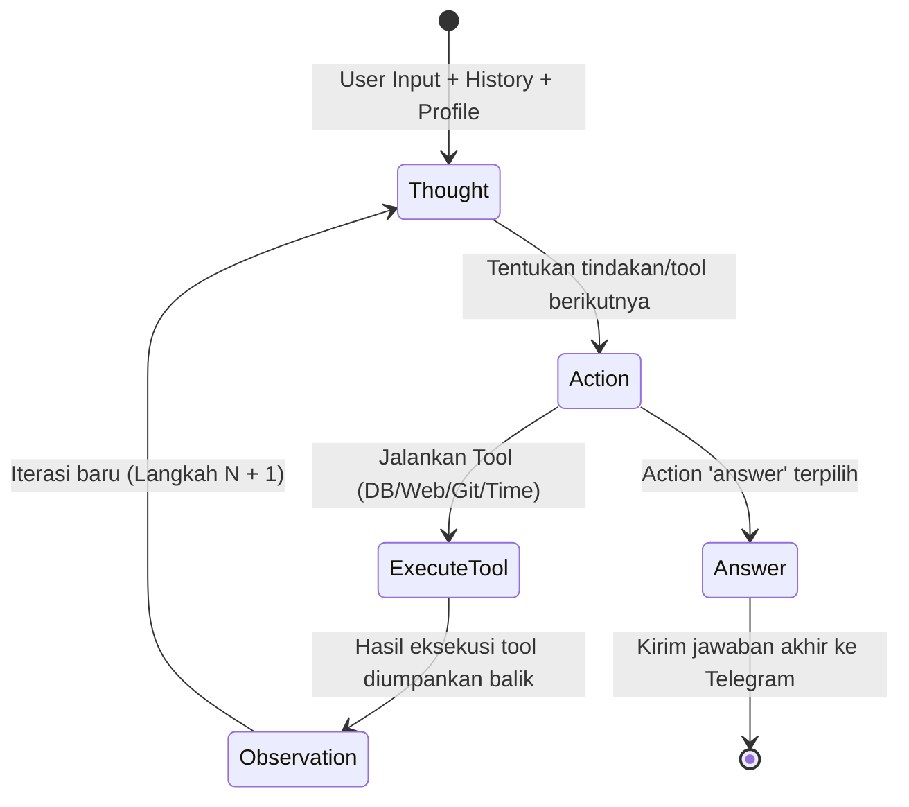

# 🛸 satunggal-ai
> **Sistem Multi-Agent AI Otonom berbasis Webhook — Ringan, Cepat, dan Cerdas.**

**satunggal-ai** adalah platform **multi-agent AI** canggih yang dibangun di atas [python-telegram-bot](https://github.com/python-telegram-bot/python-telegram-bot) v21 dan FastAPI. Menggunakan arsitektur **webhook** modern, bot ini hemat memori (RAM) dan memiliki latensi sangat rendah karena hanya aktif saat menerima pesan dari Telegram.

Untuk daftar kemampuan lengkap lihat [CAPABILITIES.md](CAPABILITIES.md).  
Untuk panduan teknis pengembangan lihat [APP_LOGIC_WORKFLOW.md](APP_LOGIC_WORKFLOW.md).  
Untuk cara menjalankan lihat [RUN.md](RUN.md).

---

## ⚡ Kenapa Menggunakan Webhook?

Dibandingkan dengan metode polling tradisional yang terus-menerus memakan resource, webhook satunggal-ai bekerja secara *on-demand*:

| Fitur | Polling | Webhook |
|---|---|---|
| **Koneksi** | Persisten (long-poll) | Hanya saat ada pesan masuk |
| **Konsumsi RAM** | Tinggi (selalu aktif di background) | **Sangat Rendah** (efisiensi tinggi) |
| **Latensi** | ~1 detik | **< 100 ms (Instant!)** |
| **Persyaratan** | Cukup internet biasa | Wajib HTTPS publik / SSL |

---

## 🧠 Sistem Otonom Hermes (Hermes ReAct Loop)

Bukan sekadar chatbot kaku yang menjawab satu arah, **satunggal-ai** ditenagai oleh **Sistem Otonom Hermes**. Pola **Hermes ReAct (Reasoning and Acting)** mengeksekusi LLM di dalam loop pemikiran terarah secara dinamis.



### 💾 Dual-Tier Memory: Memori Pendek & Jangka Panjang
Untuk mengatasi keterbatasan memori LLM, agen memiliki akses ke dua jenis memori:
1. **Short-Term Context (Sliding Window):** Menyimpan percakapan aktif (hingga 8-10 pesan terakhir) untuk memahami konteks dan kata ganti (misal: *"batalin yang tadi"*).
2. **Long-Term Memory (User Profile Store):** Tersimpan secara permanen di database SQLite (`reminders.db`). Agen dapat memuat preferensi pengguna (nama panggilan kesukaan, gaya bahasa, quiet hours) menggunakan tool `get_user_profile` dan memperbaruinya secara otonom menggunakan `update_user_profile`.

---

## 🤖 Implementasi Hermes pada Agen Kunci

Sistem Hermes telah diintegrasikan ke dalam empat pilar agen utama di platform ini:

### 1. 🔍 Developer Inspector Agent (`developer_inspector`)
Agen inspeksi repositori kode senior yang bersifat *read-only*.
* **Cara Kerja Hermes:** Menjalankan ReAct loop hingga 8 langkah untuk menyelidiki repositori secara dinamis.
* **Alat yang Digunakan:** `list_dir`, `view_file`, `grep`, `git_log`, `git_diff`, dan `search_symbols` (RAG berbasis AST).
* **Anti-Halusinasi (Critic Pass):** Setelah loop Hermes selesai, laporan dikirim ke agen **Critic** internal untuk memverifikasi setiap klaim terhadap bukti nyata sebelum dikirim ke pengguna. Temuan diberi label status tingkat kepercayaan: 🟢 **CONFIRMED**, 🟡 **LIKELY**, atau 🔴 **UNVERIFIED**.

### 2. 💬 Responder Agent (`responder`)
Asisten obrolan umum yang dinamis dan adaptif.
* **Cara Kerja Hermes:** Menjalankan ReAct loop ringan (maksimal 3 langkah) untuk memuat profil pengguna dan menentukan gaya komunikasi (*vibe*).
* **Dynamic Vibe Mirroring:** Memiliki 4 gaya bahasa yang disesuaikan secara otomatis atau manual:
  * 👔 **FORMAL:** Ramah, profesional, dan terstruktur.
  * 💼 **OFFICE:** Gaul kantoran, memanggil pengguna sebagai *"Boss"*.
  * 🤙 **GENZ:** Gaya kasual dan santai layaknya teman nongkrong (*"Gue/Lo"*, slang).
  * 🚨 **GENZ_PANIC:** Digunakan jika mendeteksi kepanikan pengguna, fokus pada solusi cepat secara instan (*"Tenang cuy, gue beresin sekarang!"*).

### 3. 🕵️‍♂️ Researcher Agent (`researcher`)
Spesialis riset web mendalam dan analisis teknis.
* **Cara Kerja Hermes:** Menguraikan (decompose) pertanyaan kompleks menjadi 3–4 sub-query, mencari di internet secara paralel via Tavily, lalu menjalankan ReAct loop 5 langkah.
* **Alat yang Digunakan:** `search` (Tavily), `read` (Web Reader untuk membaca artikel lengkap dari URL), serta manajemen profil riset pengguna.
* **Delegasi Agen:** Menyediakan antarmuka `research_for_delegation` agar agen lain (seperti DeveloperAgent) dapat memanggilnya secara instan untuk mencari informasi teknis spesifik secara otonom.

### 4. ⏰ Reminder Agent (`reminder_agent`)
Asisten pengingat jadwal pribadi yang fleksibel dan penuh pengertian.
* **Cara Kerja Hermes:** Berjalan dalam ReAct loop 5 langkah dengan akses penuh ke database pengingat aktif dan scheduler.
* **Fitur Cerdas:**
  * **Deteksi Bentrokan:** Otomatis memeriksa jadwal aktif via `list_reminders` dan memberi tahu pengguna jika ada konflik waktu (selisih kurang dari 1 jam).
  * **Deteksi Preferensi:** Mengingat instruksi rutin pengguna (misal: *"Selalu buat pengingat 30 menit sebelum meeting"*).
  * **Waktu Relatif:** Mengubah bahasa alami (seperti *"ingetin besok lusa jam 9 pagi"*) menjadi waktu UTC/WIB yang akurat menggunakan tool `get_current_time`.

---

## 📂 Struktur Proyek

```
satunggal-ai/
├── config/
│   ├── __init__.py
│   └── settings.py             # Centralized settings (pydantic-settings)
├── src/
│   ├── agents/
│   │   ├── base_agent.py       # ABC — semua agent wajib extends ini
│   │   ├── llm_client.py       # Wrapper HTTP ke OpenRouter/OpenAI-compatible
│   │   ├── repo_agent_base.py  # Base class untuk agent berbasis repo (clone/pull/RAG)
│   │   ├── gatekeeper/         # Klasifikasi intent → pilih agent + pre-agent tools
│   │   ├── responder/          # Percakapan umum, support, billing
│   │   ├── researcher/         # Riset mendalam + Tavily web search
│   │   ├── content_creator/    # Konten platform digital (LinkedIn, dll.)
│   │   ├── wbs_agent/          # WBS Gantt chart → Excel
│   │   ├── mandays_agent/      # Estimasi mandays → Excel
│   │   ├── developer/          # Clone repo → edit kode via LLM → Docker sandbox → push
│   │   ├── developer_inspector/# Inspeksi repo read-only, root cause analysis
│   │   ├── developer_qna/      # Tanya-jawab tentang isi codebase (API, model, dll.)
│   │   ├── technical_writer/   # Buat dokumen teknis PDF/DOCX dari repo atau topik
│   │   ├── doc_agent/          # Analisis, Q&A, dan edit dokumen .docx
│   │   ├── quiz_agent/         # Konversi PDF → kuis HTML interaktif
│   │   ├── sysinfo_agent/      # Laporan CPU, RAM, storage server
│   │   ├── log_viewer_agent/   # Tampilkan log bot untuk debugging
│   │   ├── web_automation/     # Autonomous browsing: buka URL, klik, isi form
│   │   └── reminder_agent/     # Set / list / cancel timed reminders via Telegram
│   ├── handlers/
│   │   ├── command.py          # /start /help /ping /reset
│   │   └── message.py          # Teks, foto, dokumen PDF, dokumen DOCX
│   ├── interfaces/
│   │   ├── rest_api.py         # FastAPI: /chat, /health, /session/{id}
│   │   ├── telegram_bot.py     # Telegram Application builder
│   │   └── webhook.py          # Webhook runner (uvicorn)
│   ├── memory/
│   │   ├── state.py            # AgentTask blackboard
│   │   ├── history.py          # ConversationHistory (in-memory)
│   │   └── repo_tracker.py     # SQLite registry repo yang pernah di-clone
│   ├── orchestrator/
│   │   ├── main_loop.py        # process_message() — controller utama pipeline
│   │   └── router.py           # INTENT_AGENT_MAP: intent → agent name
│   └── tools/
│       ├── base_tool.py            # ABC — semua tool wajib extends ini
│       ├── tavily_search.py        # Pre-agent: live web search
│       ├── wbs_generator.py        # Post-agent: build WBS Excel Gantt
│       ├── mandays_generator.py    # Post-agent: build Mandays Excel
│       ├── diagram_renderer.py     # Post-agent: render blok Mermaid → PNG
│       ├── document_generator.py   # Post-agent: Markdown → PDF/DOCX (WeasyPrint/Pandoc)
│       ├── pdf_parser.py           # Ekstraksi teks dari PDF via PyMuPDF
│       ├── web_quiz_builder.py     # Generator HTML kuis interaktif
│       ├── browser_navigator.py    # Playwright browser controller (klik, isi form, screenshot)
│       ├── web_reader.py           # HTTP page reader + a11y locators
│       ├── cli_executor.py         # Async non-interactive shell runner
│       ├── sandbox_runner.py       # Docker build/run + traceback detection
│       ├── git_manager.py          # git commit/push dengan PAT auth
│       ├── docx_parser.py          # Ekstraksi seksi/bab dari .docx
│       ├── docx_editor.py          # Edit .docx via XML operations
│       ├── sysinfo_tool.py         # Metrik CPU/RAM/storage via psutil
│       ├── reminder_store.py       # SQLite store untuk reminder jobs
│       ├── log_buffer.py           # In-memory ring buffer log bot
│       ├── repo_qa.py              # Engine Q&A: ekstraksi API, model, tech stack, dll.
│       ├── identity_generator.py   # Pembuat identitas acak untuk web automation
│       ├── progress_tracker.py     # Live-update progress message di Telegram
│       ├── wbs/                    # CLI standalone: Excel ↔ WBS JSON
│       └── mandays/                # CLI standalone: Excel ↔ Mandays JSON
├── docs/
│   └── follow_parent_flowchart.md  # Flowchart fitur follow_parent WebAutomationAgent
├── main.py                  # Entry point Telegram bot + webhook
├── requirements.txt         # Python dependencies
├── README.md
├── RUN.md                   # Panduan menjalankan aplikasi
├── START.md                 # Quickstart
├── APP_LOGIC_WORKFLOW.md    # Panduan teknis pengembangan komponen
├── CAPABILITIES.md          # Daftar kemampuan & roadmap
├── AGENT_GIT.md             # Agent dengan akses Git
└── TOOLS_API_REFERENCE.md   # Referensi API internal tools
```

---

## 🚀 Quickstart

```bash
# 1. Setup Environment
python -m venv .venv && source .venv/bin/activate
pip install -r requirements.txt
cp .env.example .env   # Lengkapi isi variabel lingkungan wajib

# 2. Ekspos Port Lokal (Development)
ngrok http 8443        # Salin URL HTTPS yang dihasilkan ngrok ke WEBHOOK_URL di .env

# 3. Jalankan Telegram Bot
python main.py

# 4. REST API (Opsional, di terminal terpisah)
uvicorn src.interfaces.rest_api:app --host 0.0.0.0 --port 8000 --reload
```

Lihat [RUN.md](RUN.md) untuk panduan instalasi dan deployment lengkap.

---

## ⚙️ Environment Variables

| Variabel | Wajib | Keterangan |
|---|---|---|
| `TELEGRAM_BOT_TOKEN` | ✅ | Token bot dari [@BotFather](https://t.me/BotFather) |
| `WEBHOOK_URL` | ✅ | URL HTTPS publik server untuk webhook Telegram |
| `OPENROUTER_API_KEY` | ✅ | API key untuk akses LLM via OpenRouter |
| `OPENROUTER_MODEL` | ❌ | Model LLM utama (default: `openai/gpt-4o-mini`) |
| `TAVILY_API_KEY` | ❌ | API key Tavily untuk live web search |
| `GITHUB_PAT` | ❌ | GitHub Personal Access Token untuk akses repositori privat |
| `SANDBOX_REPOS_DIR` | ❌ | Direktori penyimpanan repositori (default: `~/sandbox_repos`) |
| `PORT` | ❌ | Port server webhook (default: `8443`) |
| `API_PORT` | ❌ | Port server REST API (default: `8000`) |

---

## 🛠️ Menambah Komponen Baru

Tertarik untuk menambahkan Agent atau Tool baru? Silakan baca panduan teknis lengkapnya di [APP_LOGIC_WORKFLOW.md](APP_LOGIC_WORKFLOW.md).
