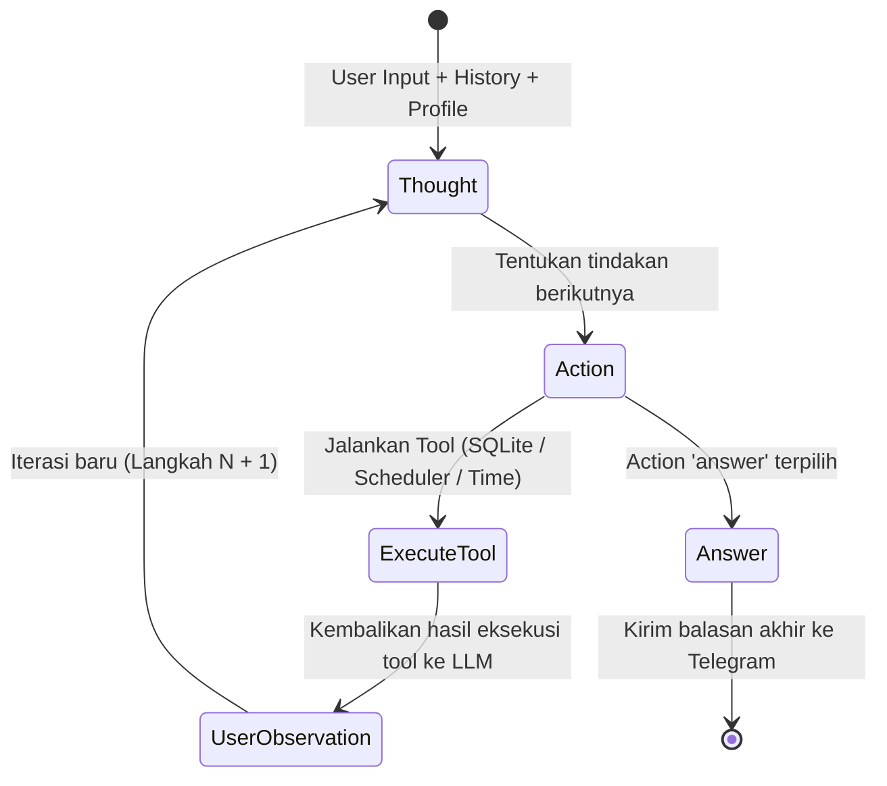

# Arsitektur Memori Hermes Reminder Agent

Dokumen ini menjelaskan arsitektur memori agen pengingat (**ReminderAgent**) yang berbasis pola **Hermes ReAct Loop**. Desain ini dirancang agar asisten dapat berinteraksi secara alami, fleksibel, mendeteksi konflik jadwal, dan mengingat instruksi khusus serta preferensi pengguna secara jangka panjang.

---

## 1. Konsep Utama: Hermes ReAct Loop

Berbeda dengan agen perintah tradisional (*command-line style*) yang kaku, pola **Hermes ReAct (Reasoning and Acting)** mengeksekusi LLM di dalam loop pemikiran terarah. 

Setiap putaran loop, LLM menghasilkan pemikiran internal (`thought`) sebelum menentukan tindakan (`action`) yang akan diambil beserta parameternya.



---

## 2. Struktur Memori Dua-Tingkat (Dual-Tier Memory)

Untuk memecahkan batasan *sliding window* di mana memori percakapan lama akan terbuang, kami membagi memori agen menjadi dua tingkat:

```
┌───────────────────────────────────────────────────────────────────────┐
│                           HERMES DECISION ENGINE                      │
└──────────────────────────────────┬────────────────────────────────────┘
                                   │
         ┌─────────────────────────┴─────────────────────────┐
         ▼                                                   ▼
┌─────────────────────────────────┐                 ┌─────────────────────────────────┐
│     SHORT-TERM CONTEXT          │                 │        LONG-TERM MEMORY         │
│     (Sliding Window)            │                 │        (User Profiles)          │
├─────────────────────────────────┤                 ├─────────────────────────────────┤
│ • 8 Pesan percakapan terakhir   │                 │ • Nama panggilan favorit        │
│ • Menangkap konteks kata ganti  │                 │ • Acara rutin (e.g. Futsal)     │
│   (e.g., "batalin yang tadi")   │                 │ • Quiet hours (Jam Tenang)      │
│ • Bersifat sementara            │                 │ • Aturan auto-prep reminder     │
│                                 │                 │ • Disimpan permanen di SQLite   │
└─────────────────────────────────┘                 └─────────────────────────────────┘
```

### A. Short-Term Memory (Sliding Window Chat History)
* **Penyimpanan:** Database SQLite (`conversation_history.db`).
* **Karakteristik:** Menyimpan hingga 30 pesan terakhir per sesi untuk mencegah pembengkakan token. Ketika diumpankan ke LLM agen, riwayat ini dipotong lagi menjadi **8 pesan terakhir**.
* **Fungsi:** Mengidentifikasi referensi kontekstual jangka pendek, seperti saat pengguna menjawab *"ya"* atau *"oke set opsi 1"* terhadap opsi yang diajukan agen.

### B. Long-Term Memory (User Profile Store)
* **Penyimpanan:** Database SQLite (`reminders.db` di tabel `user_profiles`).
* **Karakteristik:** Menyimpan preferensi penting berbentuk pasangan Key-Value JSON yang bertahan selamanya (tidak terpengaruh oleh sliding window).
* **Fungsi:** Menyimpan informasi tetap tentang pengguna (nama panggilan kesukaan, aturan auto-prep, waktu tenang) sehingga agen tidak melupakan instruksi khusus Anda.

---

## 3. Pre-Populasi Aturan Default (Default Preferences)

Saat tabel profil dimuat pertama kali untuk suatu sesi, jika pengguna belum memiliki preferensi khusus, sistem akan secara otomatis memuat preferensi default berdasarkan *hardcoded guidelines* sebelumnya:

* **`timezone_offset`:** `"7"` (WIB).
* **`auto_prep_important_events`:** `"true"` (Secara otomatis membuat reminder persiapan 30 menit sebelum event penting).
* **`important_event_keywords`:** `["meeting", "interview", "presentasi", "penerbangan", "ujian", "deadline"]`.
* **`quiet_hours_start` & `quiet_hours_end`:** `"22:00"` & `"07:00"` (Mengindikasikan jam malam tenang).

---

## 4. Aliran Kerja Pengelolaan Memori Mandiri

LLM mengelola memori jangka panjang ini secara otonom menggunakan dua alat:
1. **`get_user_profile`**: Dipanggil pada **Langkah 1** di awal loop agar LLM langsung memuat preferensi/nama panggilan Anda.
2. **`update_user_profile`**: Dipanggil ketika LLM mendeteksi bahwa pengguna memberikan preferensi permanen yang baru di tengah obrolan.

### Contoh Skenario:

1. **Pengguna:** *"Mulai sekarang panggil gue Boss"*
2. **Langkah 1 (Loop):** LLM memikirkan input pengguna dan memilih tindakan `update_user_profile` dengan parameter `profile_key="preferred_name"` dan `profile_value="Boss"`.
3. **Langkah 2 (Loop):** Setelah sukses menyimpan, LLM memanggil tindakan `answer` untuk merespon secara ramah: *"Siap, Boss! Sekarang aku panggil kamu Boss ya."*
4. **Chat Selanjutnya:** Pada chat berikutnya, saat memanggil `get_user_profile`, LLM akan menerima `"preferred_name": "Boss"` dan secara konsisten menyapa Anda sebagai *"Boss"*.
